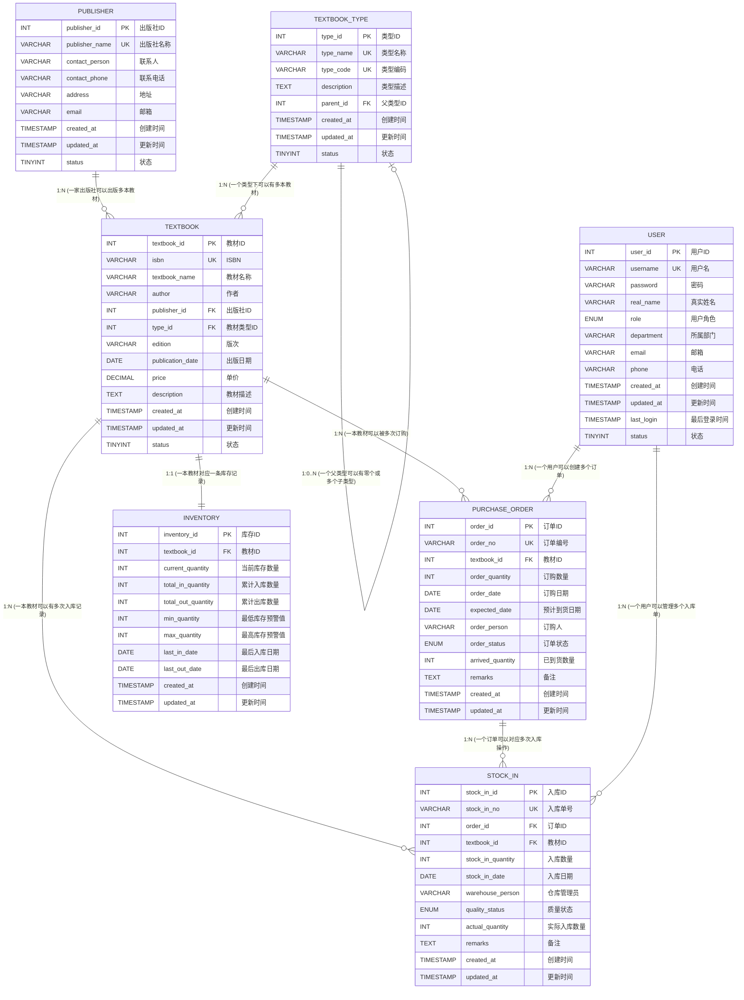
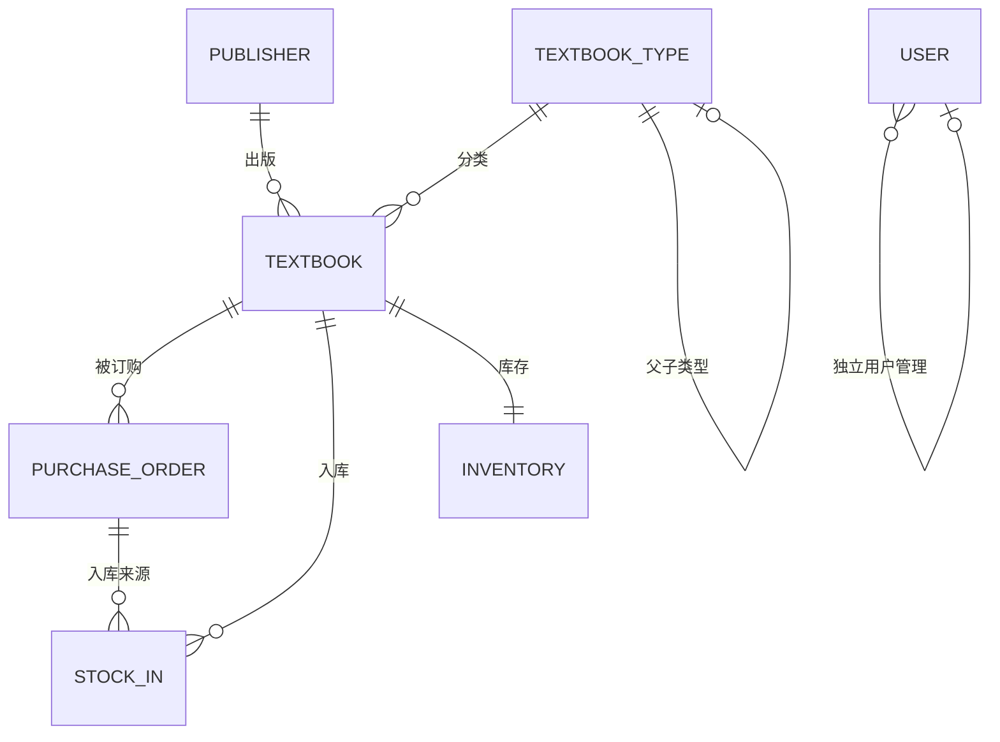

# 高校教材管理系统 - ER图与关系模式

## 一、ER图（Mermaid）



---

## 二、ER图简化版（便于查看关系）



---

## 三、关系模式（标注主码与外键）

### 1. 出版社 (Publisher)

```
Publisher (
    publisher_id,       -- 主码 (PK)
    publisher_name,     -- 候选码 (UNIQUE)
    contact_person,
    contact_phone,
    address,
    email,
    created_at,
    updated_at,
    status
)
```

| 属性 | 说明 |
|------|------|
| **publisher_id** | **主码 (Primary Key)** |
| publisher_name | 候选码 (UNIQUE) |

---

### 2. 教材类型 (Textbook_Type)

```
Textbook_Type (
    type_id,            -- 主码 (PK)
    type_name,          -- 候选码 (UNIQUE)
    type_code,          -- 候选码 (UNIQUE)
    description,
    parent_id,          -- 外键 → Textbook_Type(type_id)
    created_at,
    updated_at,
    status
)
```

| 属性 | 说明 |
|------|------|
| **type_id** | **主码 (Primary Key)** |
| type_name | 候选码 (UNIQUE) |
| type_code | 候选码 (UNIQUE) |
| *parent_id* | *外键 (Foreign Key) → Textbook_Type(type_id)* |

---

### 3. 教材 (Textbook)

```
Textbook (
    textbook_id,        -- 主码 (PK)
    isbn,               -- 候选码 (UNIQUE)
    textbook_name,
    author,
    publisher_id,       -- 外键 → Publisher(publisher_id)
    type_id,            -- 外键 → Textbook_Type(type_id)
    edition,
    publication_date,
    price,
    description,
    created_at,
    updated_at,
    status
)
```

| 属性 | 说明 |
|------|------|
| **textbook_id** | **主码 (Primary Key)** |
| isbn | 候选码 (UNIQUE) |
| *publisher_id* | *外键 (Foreign Key) → Publisher(publisher_id)* |
| *type_id* | *外键 (Foreign Key) → Textbook_Type(type_id)* |

---

### 4. 订购表 (Purchase_Order)

```
Purchase_Order (
    order_id,           -- 主码 (PK)
    order_no,           -- 候选码 (UNIQUE)
    textbook_id,        -- 外键 → Textbook(textbook_id)
    order_quantity,
    order_date,
    expected_date,
    order_person,
    order_status,
    arrived_quantity,
    remarks,
    created_at,
    updated_at
)
```

| 属性 | 说明 |
|------|------|
| **order_id** | **主码 (Primary Key)** |
| order_no | 候选码 (UNIQUE) |
| *textbook_id* | *外键 (Foreign Key) → Textbook(textbook_id)* |

---

### 5. 入库表 (Stock_In)

```
Stock_In (
    stock_in_id,        -- 主码 (PK)
    stock_in_no,        -- 候选码 (UNIQUE)
    order_id,           -- 外键 → Purchase_Order(order_id)
    textbook_id,        -- 外键 → Textbook(textbook_id)
    stock_in_quantity,
    stock_in_date,
    warehouse_person,
    quality_status,
    actual_quantity,
    remarks,
    created_at,
    updated_at
)
```

| 属性 | 说明 |
|------|------|
| **stock_in_id** | **主码 (Primary Key)** |
| stock_in_no | 候选码 (UNIQUE) |
| *order_id* | *外键 (Foreign Key) → Purchase_Order(order_id)* |
| *textbook_id* | *外键 (Foreign Key) → Textbook(textbook_id)* |

---

### 6. 库存表 (Inventory)

```
Inventory (
    inventory_id,       -- 主码 (PK)
    textbook_id,        -- 外键 → Textbook(textbook_id)，且 UNIQUE
    current_quantity,
    total_in_quantity,
    total_out_quantity,
    min_quantity,
    max_quantity,
    last_in_date,
    last_out_date,
    created_at,
    updated_at
)
```

| 属性 | 说明 |
|------|------|
| **inventory_id** | **主码 (Primary Key)** |
| *textbook_id* | *外键 (Foreign Key) → Textbook(textbook_id)*，候选码 (UNIQUE) |

> 📝 说明：`textbook_id` 同时是外键和候选码（UNIQUE），确保每本教材只有一条库存记录（1:1关系）。

---

### 7. 用户表 (User)

```
User (
    user_id,            -- 主码 (PK)
    username,           -- 候选码 (UNIQUE)
    password,
    real_name,
    role,
    department,
    email,
    phone,
    created_at,
    updated_at,
    last_login,
    status
)
```

| 属性 | 说明 |
|------|------|
| **user_id** | **主码 (Primary Key)** |
| username | 候选码 (UNIQUE) |

> 📝 说明：用户表是独立表，用于系统登录和权限管理，不与其他业务表有直接外键关联。

---

## 四、实体关系汇总表

| 关系 | 类型 | 外键位置 | 说明 |
|------|------|----------|------|
| Publisher → Textbook | 1:N | Textbook.publisher_id | 一个出版社出版多本教材 |
| Textbook_Type → Textbook | 1:N | Textbook.type_id | 一个类型包含多本教材 |
| Textbook_Type → Textbook_Type | 1:N | Textbook_Type.parent_id | 自关联，支持分级分类 |
| Textbook → Purchase_Order | 1:N | Purchase_Order.textbook_id | 一本教材可有多个订单 |
| Textbook → Stock_In | 1:N | Stock_In.textbook_id | 一本教材可有多次入库 |
| Textbook → Inventory | 1:1 | Inventory.textbook_id (UNIQUE) | 一本教材对应一条库存 |
| Purchase_Order → Stock_In | 1:N | Stock_In.order_id | 一个订单可有多次入库 |

---

## 五、外键约束行为

| 外键 | ON DELETE | ON UPDATE | 说明 |
|------|-----------|-----------|------|
| Textbook_Type.parent_id | SET NULL | CASCADE | 父类型删除时，子类型的parent_id设为NULL |
| Textbook.publisher_id | RESTRICT | CASCADE | 禁止删除有教材的出版社 |
| Textbook.type_id | RESTRICT | CASCADE | 禁止删除有教材的类型 |
| Purchase_Order.textbook_id | RESTRICT | CASCADE | 禁止删除有订单的教材 |
| Stock_In.order_id | RESTRICT | CASCADE | 禁止删除有入库记录的订单 |
| Stock_In.textbook_id | RESTRICT | CASCADE | 禁止删除有入库记录的教材 |
| Inventory.textbook_id | RESTRICT | CASCADE | 禁止删除有库存记录的教材 |

---

## 六、数据库范式分析

本系统数据库设计满足 **第三范式（3NF）**：

1. **1NF**: 所有属性都是原子的，不可再分
2. **2NF**: 每个非主属性完全函数依赖于主码
3. **3NF**: 不存在传递函数依赖（非主属性不依赖于其他非主属性）

---

> 📅 文档生成时间：2026年1月12日  
> 📁 对应SQL文件：`sql/02_create_tables.sql`


